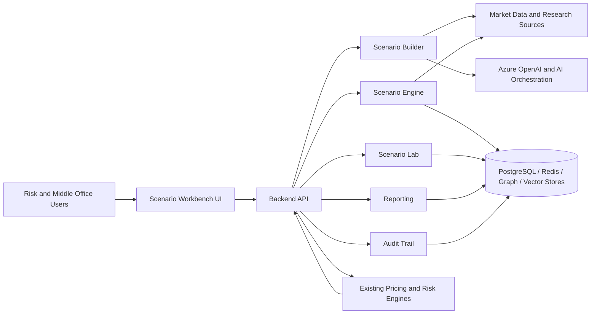
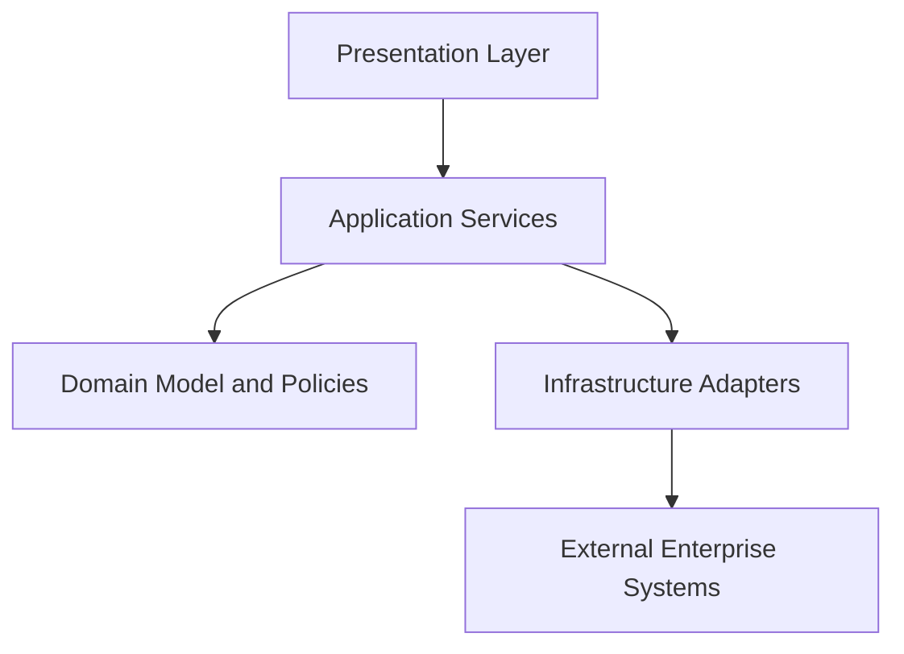
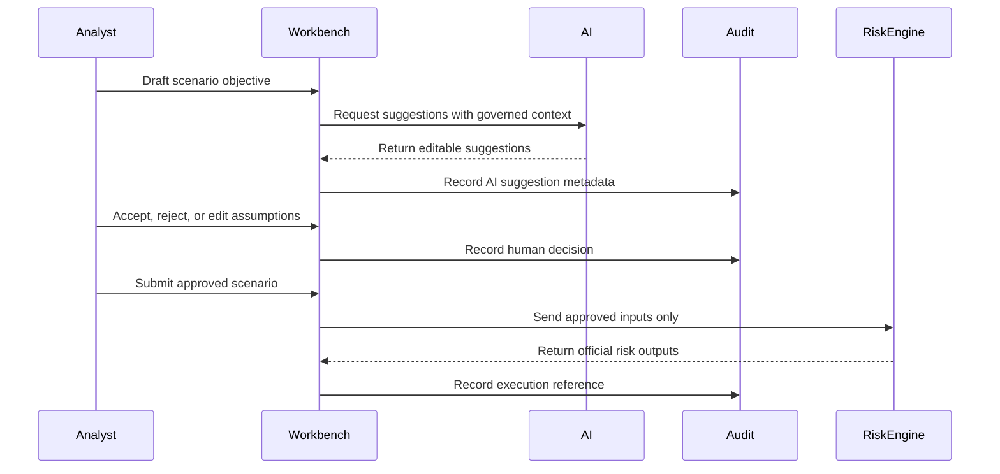

# System Architecture

Scenario Workbench is intended to be a modular enterprise application that assists scenario construction while preserving existing model governance and risk engine ownership.

## Architectural Philosophy

- Separate AI assistance from approved scenario state.
- Separate scenario construction from portfolio valuation.
- Preserve integration boundaries around pricing and risk engines.
- Make audit events append-only and reviewable.
- Keep infrastructure adapters replaceable.
- Prefer clear contracts over hidden coupling.

## Context Diagram

## Logical Layers

## Data Governance Boundary

## Key Integration Principles

- Risk engine execution must be explicit and user-controlled.
- AI output cannot directly trigger official valuation.
- Market data provenance should be retained where licensing permits.
- Scenario versions should be immutable once approved.
- Overrides must capture user, timestamp, reason, and changed fields.

